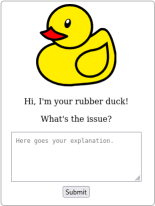

# Rubber Duck

'Tis a virtual rubber duck - SVG (66 %), HTML (27 %) and CSS (7 %). No JavaScript, no remote styles/scripts/images/&hellip; Minimal and simple (~2 KiB).

- [Rubber Duck on GitHub Pages](https://tommander.github.io/rubber-duck/)
- [index.html](https://github.com/tommander/rubber-duck/blob/master/index.html) &hellip; <q>minified</q> [dev.html](https://github.com/tommander/rubber-duck/blob/master/dev.html)[^1]  
`ada344f3c7c510a33c4aaf6d97c4a478c33d9cccdc54cbf5117a10755e7df2f8`
- [dev.html](https://github.com/tommander/rubber-duck/blob/master/dev.html) - formatted source code used for development  
`7ebbb04c645d5aba1275b4bdcfec77038bdbad4f641d6c8867b688dab3913b87`
- [Article about rubber ducking on Wikipedia](https://en.wikipedia.org/wiki/Rubber_duck_debugging)