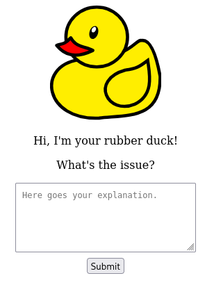

# Rubber Duck

Virtual rubber duck. Say goodbye to private room retreats pretending you are on a call when you really just need to rubber duck a problem.

- Only HTML, CSS and SVG
- No JavaScript
- Independent on local/remote files
- Small size (~2 KiB)
- Simple design

Installation and usage instructions in case you never [rubber ducked](https://en.wiktionary.org/wiki/rubber_duck_debugging) before or you cannot imagine how to use a virtual one.

1. Download either [ducky.html](https://github.com/tommander/rubber-duck/blob/master/ducky.html) (good for editing or studying the immense beyond-complex source code) or [ducky.min.html](https://github.com/tommander/rubber-duck/blob/master/ducky.min.html) (for <q>production</q> use)
2. (Recommended) Verify SHA256 checksum of the downloaded file
3. Open the downloaded file in your favourite browser (e.g. [Firefox](https://www.firefox.com/))
4. [ELI5](https://en.wiktionary.org/wiki/ELI5) your issue to the *virtual* rubber duck as if it was your *real* rubber duck

Note: submit button does nothing. Nothing. But I know you'll click on it anyway.

That's it, folks.
